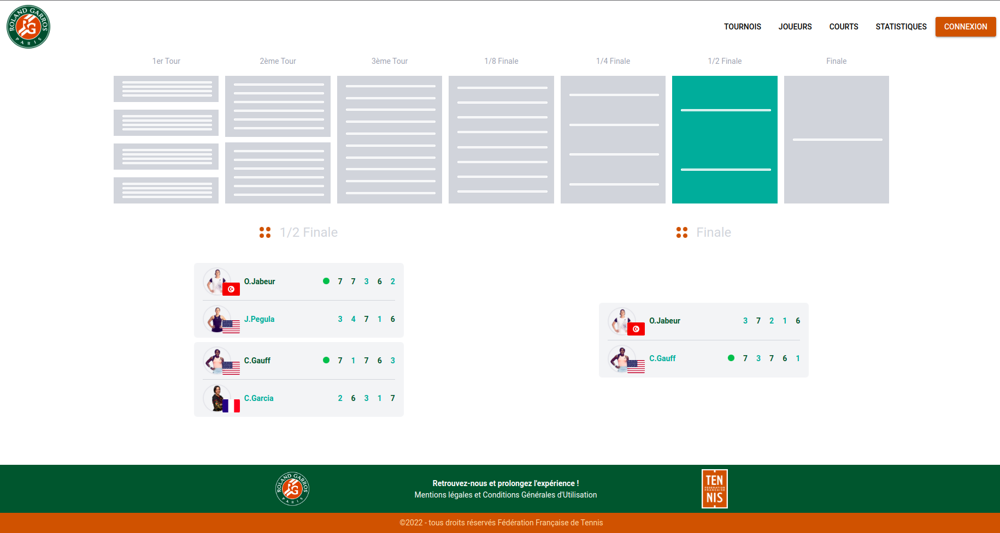

# Roland Garros

Clone of the Roland Garros website, created as part of the computer engineering studies program at ENSSAT.



## Installation

To install the app, you need to have Docker.

```bash
make install
make start
```

You can access the application with [app.localhost](app.localhost).

> [!IMPORTANT]  
> By default, the application runs on port 80. Please check that the port is not already assigned or change it.
